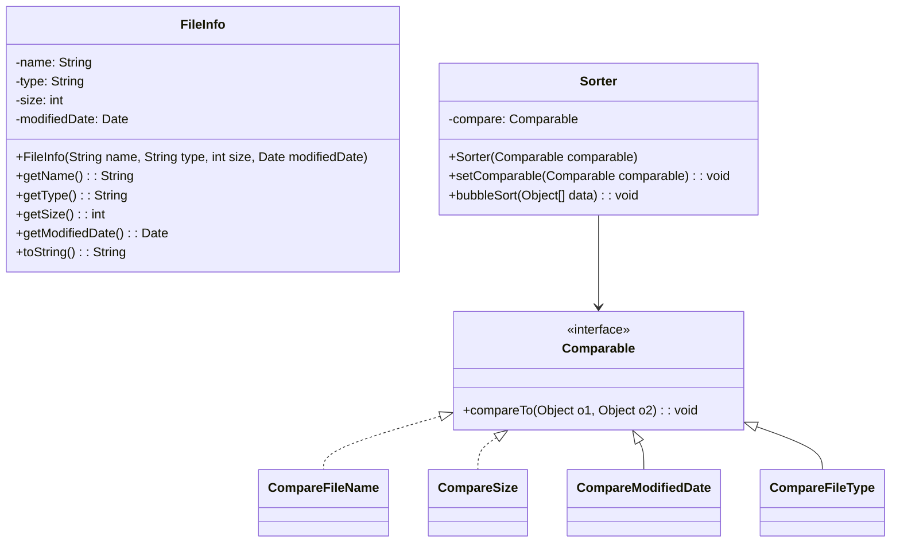

> Strategy 패턴 실습

# 실습과제 #03-1

* 스트래티지 패턴을 이용해서 파일 속성을 다양한 형태로 비교해서 정렬해서 출력할 수 있는 프로그램을 작성할 것

```mermaid
classDiagram
    class FileInfo {
        -name: String
        -type: String
        -size: int
        -modifiedDate: Date
        +FileInfo(String name, String type, int size, Date modifiedDate)
        +getName(): String
        +getType(): String
        +getSize(): int
        +getModifiedDate(): Date
        +toString(): String
    }

    class Sorter {
        -compare: Comparable
        +Sorter(Comparable comparable)
        +setComparable(Comparable comparable): void
        +bubbleSort(Object[] data): void
    }

    class Comparable {
        <<interface>>
        +compareTo(Object o1, Object o2): void
    }

    Sorter --> Comparable
    Comparable <|.. CompareFileName
    Comparable <|.. CompareSize
    Comparable <|-- CompareModifiedDate
    Comparable <|-- CompareFileType
```
